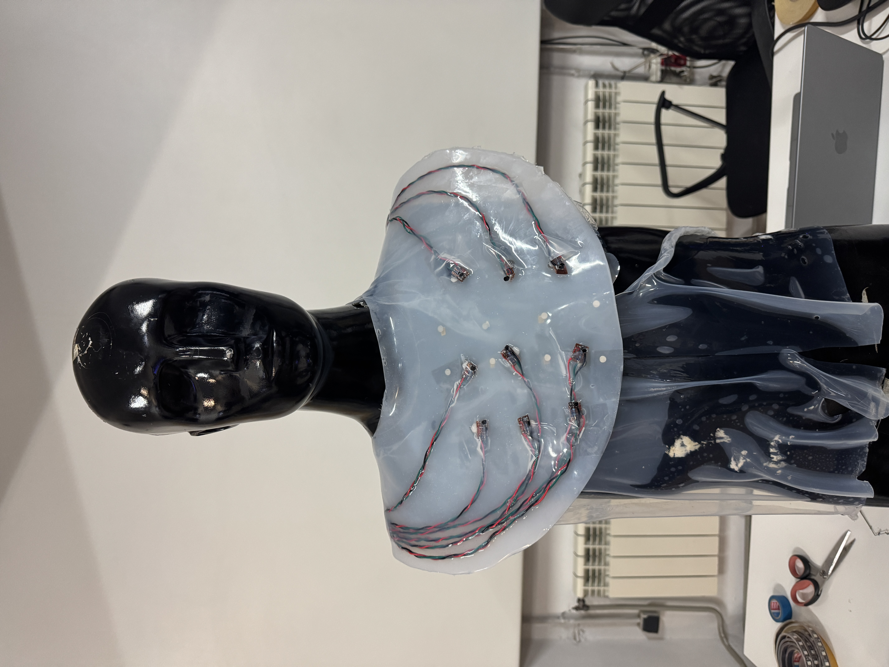

# Cognitive Orgies II

## [Link to hackerster.io project](https://www.hackster.io/545047/stocksense-610f0b)

## Background   

I wanted to use this edition of Cognitive Orgies to iterate on the the previous compborg prototype. I didn't want to focus on compost, but I wanted to build out the underlying technology and make the changes from feedback that I had received. I envisioned working on Multisense - a wearable and platform combo that lets users map real time data to haptic patterns.  

Erandi is working on other species justice and was particularly interested in exploring how humans can gain insight into the lived experiences of sparrows. She was sitting next to me when I was explaining what I wanted to explore, and mentioned that our ideas overlap really well. Mine provided the technical foundation to build on, and hers provided the conceptual focus.

Unfortunately, we found out that there are not many live-data streams related to sparrows, or any other birds for that matter. We decided we would try to do vision mapping with live-stream videos from bird nests, but to first test that the artifact works using stock information as a proof-of-concept. For better or for worse, that choice ended up defining our project, since due to time constraints we had to stick with stock information and weren't able to include any data related to bird movement. 

## Mapping Traces  

### Cognitive Traces  

moments where your way of thinking changed, you doubted an assumption, rewrote the question, or resisted the first plausible answer (human or AI).

### Moral Traces  

One of the most impactful decisions we made was choosing to not divide the labor in a major way. We both wanted firsthand experience with all the steps of the process. This slowed us down a bit, but ultimately it was worth it because we both walked away feeling like we had learned something new. That said, there was some division of labor that happened naturally without us planning it. Since we started doing the software side of the project on my computer, I ended up doing more of the work with Node-RED and latter the wrapper around it. I also ended up doing more of the coding as it pertained to the haptics and how they functioned. Erandi was still there participating, but I was the one to input things on the keyboard. That couldn’t have been as fun for her. I would love to learn more about best-practices for software collaboration. I feel like we never went over that during any precourse, or fundamental for future makers course. This would also be useful for some of us after the masters if we have to collaboratively work on code in a professional setting. 

Because I spent a bit more time on the software side, naturally Erandi spent a bit more time on the physical side. Namely, the soldering. Erandi is amazing at soldering. At one point the Raspberry Pi Pico 2 W wouldn’t connect to the wifi, and while I spent an hour troubleshooting it (spoiler alert - I just needed to go to a different room) Erandi took care of the bulk of our motor soldering. 

### Technical Traces  

The biggest technical trace for me was everything that was related to the use of silicone in the project. When Julia mentioned that we could embed the motors in silicone, it felt like we had hacked the system. The two biggest issues from the previous project were securing the motors in place and keeping their wires safe (since they are super thin and break easily). We thought that embedding them in silicone would fix both issues. We were right….but every problem solved creates another problem.  

After pouring the silicone for the vest and leaving it overnight, we returned to find it still wet. This was way past its 4 hour curing time. We had to run to the store in the pouring rain, and buy more silicone. We bought the wrong one and had to make the trip one more time, this time buying a mix that cured in 20 minutes. By this time it was Friday and we only had one take to get it right. It turns out we needed twice as much silicone to make the vest how we imagined it, so we decided to pour it in a kind of bib formation. This formation led us to concieve of it as a usekh collar, and we were able to take that inspiration to build on the narrative elements of the artifact. 
