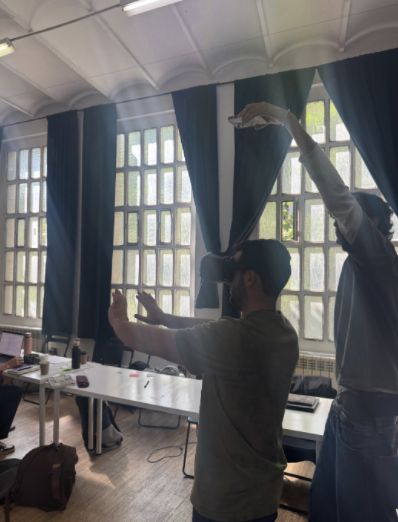

# Cognitive Orgies III

## [Link to hackster.io project](https://www.hackster.io/548967/outerbody-6223f8)

For this cognitive orgies session we were given the brief to build a performance. The previous sessions have been very artifact based. For this week, we were encouraged to think backwards: what do we want our audience to experience, and what do we have to build to accomplish this?  

My group decided that we wanted to provide an out of body experience for our audience. This was vague enough to have room for experimentation, but specific enough to have a clear idea of where to start, and what our KPIs could be.  

As explained in the hackster.io project, we went with using 3 phones and a VR headset (that you put a phone in) to create a choreographed performance. The experience relied just as much on the successful enaction of our choreography as it did on the tech we set up for it. That felt really refreshing, because so much of my explorations this year have felt tech-heavy, and it was nice to get a different perspective. I think we spent as much time prototyping the choreography as we did prototyping the tech setup.

This session of cognitive orgies was unique in the sense that my group did not fabricate anything physical or write any code to accomplish our performance, and yet it was a huge success. It goes to show that if you creatively use existing tech you can have great, if not better, outcomes then if you are blindly dedicated to fabricating something "new".  

It was surprising to me how confusing it was to set up one phone's video to run through a computer and be manipulated and then end up on another phone's screen. We ended up having a pretty ingenious solution, but there has got to be another, more simple way. Video calls are so ubiquitous, I would have thought the solution existed already. Maybe that route is another thing we could explore in future iterations.

The main future iteration I'd like to explore is to reduce the latency to as close to 0 as possible. There was still a latency of 300-500ms that wasn't unbearable, but left the experience feeling a little clunky. I wonder if a wireless hdmi or using a private wifi server would fix that. After improving the latency, I'd love to play around and prototype different performances along the lines of the ones the [machine to be another](https://beanotherlab.org/home/work/tmtba/) organization does.

