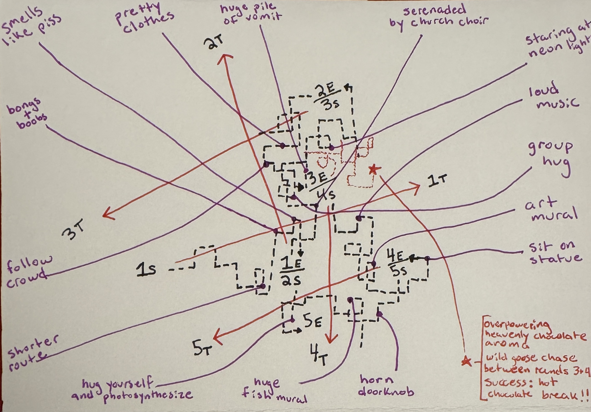

# Design Studio 1 - Collective Action

## ATTENTION ECONOMY - A COLLECTIVE DÉRIVE

**MAP OF ATTENTION ECONOMY COLLECTIVE DÉRIVE - BARCELONA, SPAIN - NOV 30, 2025**

**AUDIOVISUAL ESSAY**
<iframe width="560" height="315" src="https://www.youtube.com/embed/hNOFLryQHRw" title="YouTube video player" frameborder="0" allow="accelerometer; autoplay; clipboard-write; encrypted-media; gyroscope; picture-in-picture; web-share" allowfullscreen></iframe>

**SUMMARY**  
This is a walking Dérive played by a group. One person is the Leader, who chooses where to go. The others take on roles that override the Leader’s decisions using specific rules. Each role represents a distinct force acting on human attention and can intervene only under defined conditions. Together, these interventions create a live “attention battlefield,” revealing how intention, disruption, and recovery unfold collectively in real time.

**GAME EXPLANATION**  
A group chooses roles and walks through the city.
The Leader chooses a direction and tries to maintain it.
The other players hold role cards that allow them to intervene up to three times per round when specific triggers appear.  

Each intervention forces the Leader to change direction.
After 10 minutes, the round ends, roles rotate, and the next round begins from where the last one ended.
Over multiple rounds, the group experiences how different attention forces reshape navigation and orientation.  

**CONCEPTUAL FRAMING**  
The attention economy is not driven by a single mechanism but by a coordinated system of forces that pull, redirect, optimize, and fragment human attention. In everyday life, these forces act simultaneously and invisibly, shaping how individuals and groups navigate space, make decisions, and experience themselves.  

This dérive makes these forces explicit, embodied, and collective. Instead of encountering them through screens, participants enact the logic of the attention economy in physical space: the Hijacker mimics sudden algorithmic redirections, the Optimizer mirrors platform-driven efficiency, the Doomscroller simulates overstimulation and dissociative pull, and the Grounder models the rare counterforce of embodied presence.   

By moving together through the city while these forces override the leader’s intentions, the group experiences attention not as a private mental phenomenon but as a distributed, contested resource shaped by infrastructural, algorithmic, and sensory ecologies.  

In doing so, the dérive reveals how attention is governed, how intention becomes unstable, how digital intoxication emerges from disruption, and how embodiment must be actively reclaimed. It transforms an abstract system into an experiential, collective act.  

**WHY THIS COLLECTIVE**  
I chose to work with my fellow MDEF classmates as a collective because we share the same pressures of the attention economy: digital distraction, optimization, overstimulation, and the need to stay present in a demanding learning environment. Rather than observing them, I created a horizontal structure where we could experience these forces together through a shared dérive. My contribution was designing a group dérive protocol that attempted to make invisible attention pressures tangible through embodied roles and collective movement.  

As a collective, we needed this activation because attention is not just an individual struggle, but a shared condition shaped by digital, spatial, and social forces. Our broader objective was to strengthen our capacity to feel more in charge of our attention so that we can be more present in the world. The dérive served this goal by allowing us to encounter the multiple forces acting on attention at once, and to use role-playing as a way to recognize, map, and resist them.  

## PROTOCOL

**OVERVIEW**  
A group dérive exploring how different forces in the attention economy shape movement, perception, and orientation.   

Each round is 10 minutes.   
Roles rotate each round.  

**1. MATERIALS**  
5 role cards:

- Leader  

- Hijacker  

- Optimizer  

- Doomscroller  

- Grounder    

Smartphones (Leader for pins; Grounder for compass)  

A watch or timer for 10-minute rounds  

**2. GROUP SETUP (Before Starting)**  
Assign the five roles for Round 1.  

If fewer than 5 participants: one person plays *both* Doomscroller & Grounder.  

If more than 5 participants: extra people walk as observers.  

Review each role card so everyone knows:  
- when they can act  
- what they must do  
- how many uses they have  

Agree on how many rounds you will do:   
- Recommended number: as many rounds as there are players, so each person gets to embody a different force.  

**3. ROUND STRUCTURE**  
*3.1 Leader Sets Intent*  
- Leader quietly chooses a direction (N/S/E/W or a combination).  
- Leader privately tells only the Grounder.  

*3.2 Choose Starting Location*  
- For Round 1: begin at the originally chosen starting point.  
- Leader drops the start pin. (Titled: Round #, Start)  
- For all subsequent rounds: start where the previous round ended (no need to drop a pin)  

*3.3 Mark Intended Target Location*  
- To measure how far the group drifts from intention:  
- Leader drops a target pin roughly 10 minutes’ walk in the chosen direction. (Titled: Round #, Target)  

*3.4 Begin Moving*   
- Leader starts 10 minute timer and begins walking in the chosen direction.  
- Other roles walk alongside, waiting for their triggers.  

*3.5 Roles Intervene When Triggered*  
- Refer to the role cards for each role’s specific triggers, limits, and spoken commands.  

*3.6 Leader Complies*  
- Leader follows every command immediately.  

*3.7 End of Round*    
- At 10 minutes: stop.  
- Leader drops an end pin. (Titled: Round #, End)  
- Note visually or mentally how far the group ended from the target pin.  

**4. ROLE ROTATION**  
Rotate roles each round so that over the full dérive each participant embodies different forces.  

New Leader chooses a new direction and repeats the process.  

**5. WRAP-UP (Reflection Questions)**  
Gather the group and discuss:  

*Embodiment*    
- Which role felt most natural? 
- Which role felt hardest to embody?     

*Attention Dynamics*  
- What types of stimuli were hardest to resist?  

*Forces & Power*  
- Which roles exerted the most control over the collective path?  
- Which interventions created the biggest directional shifts?  

*Orientation & Disorientation*  
- How did Hijacking feel compared to Optimization?  
- How did Grounding change the group’s awareness or orientation?  

*Real World Parallels*  
- Where (if at all) do you experience these forces in your own digital life?  
- What surprised you about how attention behaved collectively?  

**5. DOCUMENTATION METHOD**  
For each round, capture:  
- Start pin  
- Target pin  
- End pin  

Notes on which role caused which directional changes  

Photos or short clips of:  
- Hijacker interruptions  
- Optimizater overrides  
- Doomscroll pulls  
- Grounding resets  

Observers’ notes (if any)  

After the dérive is complete, map the path and compare:  
- Intended directions & actual paths  
- Moments of strongest interventions 

##ROLE CARDS
**LEADER**  
Holds a clear direction while others disrupt, reroute, or intoxicate attention.  

<ins>Represents:</ins> focused intention in a field of competing forces.  

<ins>Responsibilities:</ins>  
- Choose a cardinal direction at the start  
- Open your phone once to check where that direction is  
- Tell only the Grounder  
- Drop 3 pins each round:  
(1) Start pin  
(2) Target pin (~10 minutes in your chosen direction)  
(3) End pin  
- Try to maintain your direction  
- Comply with all role actions  

**HIJACKER**  
Creates sudden interruptions that snaps the leader off their path.  

<ins>Represents:</ins> algorithmic interruptions like ads, notifications, and other prompts that abruptly seize attention and redirect intention.  

Triggers:  
- Any advertisement  
- Bright screens  
- Flashing/moving images  
- Anyone in the group using their phone  
- Sudden sensory pops  

<ins>Commands:</ins>  
- “Turn this way now.” (point in any new direction)  
- “Go toward that.” (point at the trigger)  

<ins>Uses:</ins> Up to 3× per round  

**OPTIMIZER**  
Nudges the leader toward the most efficient or frictionless route.  

<ins>Represents:</ins> routing algorithms, recommendation systems, and defaults that steer users toward efficient, predictable paths.  

<ins>Triggers:</ins>  
- Multiple paths appear (corners, forks)  
- Leader hesitates or slows  
- One route is clearly more efficient  
- Passing a large group/crowd  

<ins>Commands:</ins>  
- “Take the more efficient route.” (point to route)  
- “Follow that flow of people.” (point; ~1 min)  

<ins>Uses:</ins> up to 3× per round  

**DOOMSCROLLER**  
Pulls the group into overstimulation and immersive sensory drift.  

<ins>Represents:</ins> infinite scroll, autoplay, sensory overload.  

<ins>Triggers:</ins>  

*Act only after a Hijacker or Optimization command*
- Bright/neon lights  
- Ads, bars, alcohol, music  
- Glowing screens  
- Crowds    
- Sensory overload or repetition  

<ins>Commands (choose one):</ins>  
- “Go toward that.” (point to strongest stimulus)  
- Lead the group into a dense / loud / bright zone  

<ins>Uses:</ins> up to 3× per round  

**GROUNDER**  
Resets the group through embodiment, then restores direction.  

<ins>Represents:</ins> presence, reconnection, intentionality.  

<ins>Triggers:</ins>  

*Act after any intervention by:*  
- Hijacker  
- Optimizer  
- Doomscroller  

<ins>Commands (all 3):</ins>  
- Give a grounding cue (“Feel your feet,” “Touch this surface,” etc.)  
- Check your phone’s compass  
- Point and lead group back toward the Leader’s original direction  

<ins>Uses:</ins> up to 2× per round  

## Reflection

I need to add some thoughts here....still thinking.

