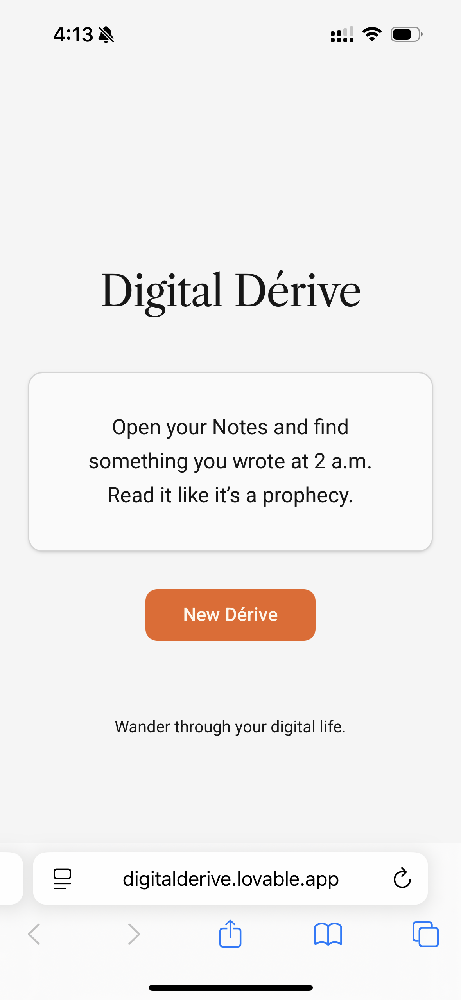

# Design Studio 1 - Prototypes

## Overview

After the first week of 1PP research it was time to draw some observations and figure out how I could act within my context. I had some major takeaways. Most notably:  

**(1):** Like some sort of digital pacifier, my attention reliably drifts towards my phone when I am dealing with uncertainty. More specifically, when making a decision of where to go or what to do in the world around me, I use Google Maps as a kind of uncertainty reducing tool.  

**(2):** I follow the same digital "pathways" when I open my phone. Regardless of if I open my phone to send a text or play music, I often ended up checking my messages, checking my email, and ending up on some form of social media.  

**(3):** The longer I am on my phone, the more my attention gets sucked into it, creating a digital intoxication loop. When this happens I feel completely disembodied, as if I am a little homunculus sitting in a room in the back of my frontal lobe, unaware of the rest of my body connected to it.  

Drawing from these observations, I created a conceptual statement to give a container to my prototyped actions. 

## Conceptual Statement
These prototypes examine how my phone mediates my relationship with the physical world. In my daily life it is my default interface for navigating uncertainty; replacing wandering with efficiency, and intuition with optimized decision making. The problem is not the phone itself, but how easily my attention becomes disembodied, oriented toward digital cues rather than my surroundings or senses. These digital cues lead to automatic habits, which accumulate into patterns I no longer notice. With these prototypes I am attempting to create situations that interrupt those defaults, revealing how digital logic governs me, and where moments of re-embodiment might emerge. The objective is to study what shifts when I break automation, allow uncertainty back into my decisions, and let my body, attention, and environment re-enter the loop. 

## Social Dérive  

**Hypothesis:**
If I navigate the city by asking strangers in person for recommendations instead of relying on digital reviews, then I will experience how uncertainty is experienced differently when mediated by real people, and how my attention shifts when guidance comes from unpredictable human interactions rather than algorithms.

While gathering my 1PP research, I noticed that one of the main reasons I used my phone was to use Google Maps. More specifically, I used Google Maps to determine where to go next, usually when searching for food or general entertainment.   

Instead of wandering with a sense of open curiosity, I would search for something in Google Maps, and filter through the choices it presented me by reading the reviews. I had no way to know if these reviews were authentic or not (written by bots, written by real people who had been paid, etc). Furthermore, even if they were written by real people and were totally authentic, I had no way to know if these peoples' tastes were similar to my own. Why would I give weight to a review from someone I had never met and knew nothing about? Because it's easier to do that than ask people in non-digital "real" life.   

<iframe src="https://docs.google.com/document/d/1SLy07vbQHGW7Y96WAM8bSu2Ohm7tPvS7seRaL8Bd1pc/preview" width="100%" height="600" frameborder="0"></iframe>

**Reflection:**  
This prototype felt the most uncomfortable of the three, which made me feel like it had the most potential for further experimentation. It was my first time designing a dérive, and I learned that less is more. I had a few people try the dérive and none of them were able to follow the instructions verbatim. Even I had trouble following the rules, and I'm the one who wrote them. My biggest surprise from the dérive was how uncomfortable I felt going up and asking people for recommendations. I consider myself an outgoing person, and yet there was something  vulnerable about approaching a stranger on the street. 

<ins>What it enacted:</ins> It shifted my attention outward into the city, making navigation a social and embodied act instead of a digital one.  

<ins>What transformed:</ins> Uncertainty became something I managed through interaction rather than algorithms.  

<ins>Errors / Exceptions:</ins> I noticed how uncomfortable I had become with approaching people, revealing how much confidence and decision-making I normally outsource to my phone.  

## Digital Dérive

**Hypothesis:**
If I build a Shortcut that gives me random dérive-like prompts whenever I unlock my phone, then I will interrupt automatic digital pathways and test whether I can re-enchant my attention in digital spaces.

I used lovable to create a basic webapp that would be a functional interface for the digital derive. I wrote 10 example digital derive prompts, and then asked ChatGPT to generate 50 more in the same style. Once it was working I created a shortcut on my phone to open to the webapp whenever I used the shortcut button to open my phone. 

[Click this link to access the Digital Derive](https://digitalderive.lovable.app/) 

**Reflection:**  
I really liked the outcome of the digital derives. I felt that it did re-enchant my relationship to my phone, and it felt nice to move through the digital architecture in novel ways. But, at the end of the day it was exactly that - a novelty. I don't think it did much more than provide a fun experience. I also feel like it completely avoided engaging with how I interact with and pay attention to the world around me.  

<ins>What it enacted:</ins> It briefly re-enchanted digital space and exposed the rigid pathways I follow inside my phone.  
    
<ins>What transformed:</ins> I explored digital environments with more curiosity, but only temporarily.  

<ins>Errors / Exceptions:</ins> The novelty faded quickly, showing how easily digital systems absorb disruptions without truly changing my attention patterns.   

## Mirror Mode

**Hypothesis:**
If I suddenly see my own face during moments of digital intoxication, then I will become more aware of how my body appears and feels during disembodied attention and notice the dissociation that normally goes unseen.

One of my big takeaways from my 1PP research was that I often opened my phone for one reason, and then found myself doing something completely different, almost unaware of how I got there, and feeling completely disembodied. The best way to describe it would be digital intoxification. I thought that if I only were to be able to see my stupid face when I was scrolling I would be able to re-embody and break the digital intoxification. Some people want breathwork and meditation, I just want to see how dumb I look from my phone's perspective. 

To accomplish this I a made super simple Apple shortcut that opens the front camera of my phone once I've been on my phone for 90 seconds.

I wasn't able to make it run perfectly. I wanted it to run every time my phone was opened, but Apple took away the ability to run a shortcut whenever u open your phone, so I had to remember to run it manually each time. I have gotten in the habit of doing this from the other shortcuts I've made, but there were still missed instances where it could have been useful. Also, if it triggered after 90 seconds and then I went back to scrolling it wouldn't trigger again. I couldn't figure out how to fix this, so it was pretty limited in its utility. 

You can try it out for yourself if you want to. [Download Mirror Mode using this link](https://www.icloud.com/shortcuts/f1d2d563c02b41aaaea7e7311a050794)

**Reflection:**  
Mirror Mode was surprisingly useful at first. I would be zoned out on a Reddit thread and my face would pop up and it would usually lead to me putting my phone down. 
However, like most things, I started to get used to it and it quickly lost its power. By the third day I would just exit the camera and go back to what I was doing. It felt like a fun little tool to make, but didn't feel substantive enough to develop into a larger act.

<ins>What it enacted:</ins> It created moments of re-embodiment by interrupting digital intoxication with my own face.  

<ins>What transformed:</ins> At first it successfully broke the trance and returned awareness to my body.  

<ins>Errors / Exceptions:</ins> I adapted to the interruption and it lost effectiveness, revealing how quickly the body normalizes self-imposed friction.

