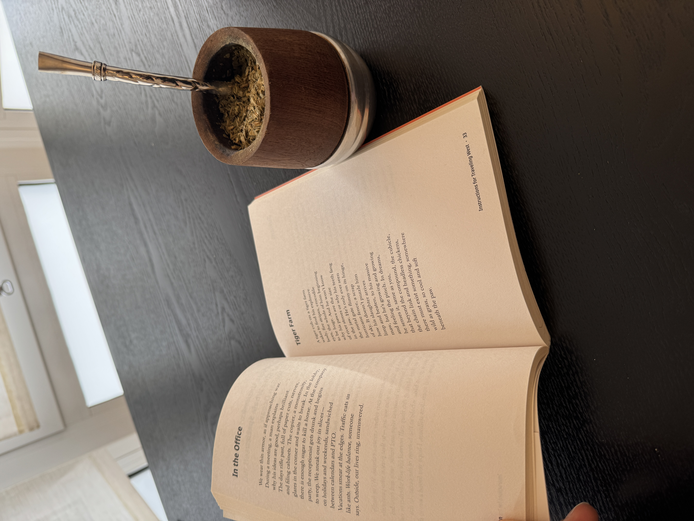
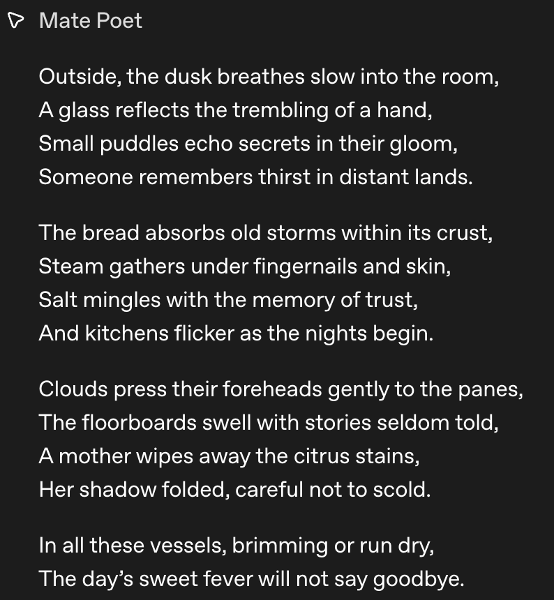
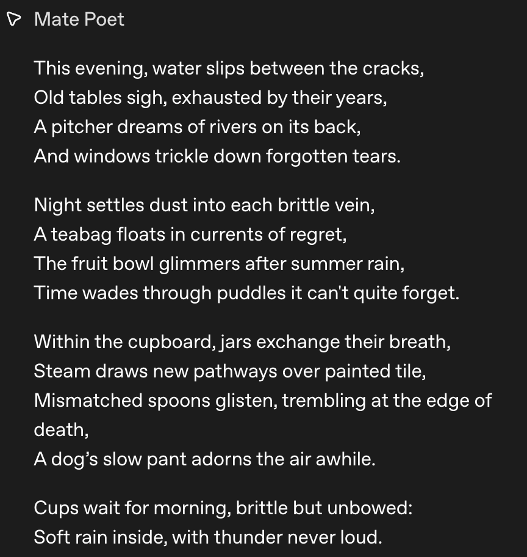

# Extended Intelligences II

I was back in Chicago during this week and missed this entire class. I had to catch up when I got back to Barcelona without any in-person guidance. Even if I had gotten in-person guidance, I don't think it would have changed the difficulty level. This was by far the most technologically frustrating class so far. 

Luckily (or not), I was able to use ChatGPT as a coding guide to work my way through the assignment. On one hand, I feel empowered by this collaborative possibility. It's incredible that as someone with absolutely zero coding experience I am able to set up a raspberry pico 2 w with MCP protocol. On the other hand, I feel extremely dependent on ChatGPT to accomplish this. If it was to go offline tomorrow, I would not be able to do this from scratch.  

This class taught me as much about my deep interdependence with AI just much as it taught me about hardware integrated MCP. AI has opened the door for self-learners like me to approach technical tasks that we know little about. Of course, the door was always open, but now I can accomplish something in 2 days that would have taken me 2 weeks (or more). As much as I love the process of learning, I am willing to sacrifice some of the foundational technical knowledge for the ability to rapidly prototype the projects I'm curious to explore. Considering that the title is Extended Intelligences II, I think that is a very relevant take away. 

## MatePoet

In this class our brief was to attach some sort of sensor to a raspberry pi pico 2 w to collect data and relay that to an AI agent using MCP. As I read the class slides from my computer, I felt a bit lost as to what sensor and what output I wanted to work with. Then I looked over and saw my mate gourd next to the poetry book I was reading that morning. Problem solved: I decided to use a moisture sensor to generate a poem each time I took a sip from my mate. 

  

### Mate Poet in Action  
<iframe width="100%" height="400" src="https://www.youtube.com/embed/z5SGmDn3ikI" title="YouTube video player" frameborder="0" allow="accelerometer; autoplay; clipboard-write; encrypted-media; gyroscope; picture-in-picture; web-share" allowfullscreen></iframe>

### Examples of the Generated Poems
  

### Reflections

Below I am going to put a technical outline of the process (generated from my "guided lessons" with ChatGPT). Before I share that, I want to quickly reflect on the MCP. Namely, where it fell short. I was really excited to work with MCP because everything that I read framed it as a groundbreaking framework for connecting AI (more specifically LLMs) with hardware. I don't really get the hype. I was not able to get it to act in a meaningful way. I think that is more of a reflection on me than on MCP. 

The main frustration I had was that I wanted the AI agent to run in the background and generate a line for the poem every time there was a meaningful change in the moisture levels, but it was unable to do that. Instead it had to be prompted before every sip, and it could only (or rather, I could only get it to) generate entire poems at once, not line at a time. I was able to make it so that each line was generated from a meaningful change in moisture levels, but it felt like a bit of a let down after how high my expectations were. 

I would love to see some more examples of MCP bridging AI and hardware in projects that are similar to the ones I and my classmates are working on. 

## Technical Overview

Here is a brief summary of the steps I took (with the help of ChatGPT) to accomplish this project. 
Besides ChatGPT, here are the resources I used on this project: [Resource 1](https://github.com/matta-pie/MDEF-DesigningWithExtendedIntelligence2/blob/main/examples/simple_mcp.py) and [Resource 2](https://github.com/matta-pie/micro-mcp/blob/main/micro_mcp/mcp_server.py)  

### Phase 1 — Verifying the Hardware  

File: [blink.py](https://drive.google.com/file/d/1WqifttprnaGWljvMOxNKutDw7DYmq3yD/view?usp=drive_link)  

Before integrating sensors or networking, I confirmed the Pico 2 W was functioning properly. A simple LED blink script verified that MicroPython was installed correctly, GPIO output worked, and the development pipeline was stable. This established a reliable embedded baseline before adding complexity.  

### Phase 2 — Reading Moisture Values  

Files: [reatmatetest.py](https://drive.google.com/file/d/1zznmOelnm-c9lpOyFYz4JJdRoqdrWtyM/view?usp=drive_link), [readmate.py](https://drive.google.com/file/d/1hiCuKaMxZKv57xws8HeHSP9FHRErIy1y/view?usp=drive_link)  

The moisture sensor outputs analog voltage, which the Pico reads using its ADC and converts into numeric values. Early attempts mapped these values into discrete states, but gradual moisture changes and electrical noise made classification unstable. This confirmed the sensor was working but revealed that raw readings required stabilization before meaningful interpretation.  

### Measuring Moisture  
<<iframe width="100%" height="400" src="https://www.youtube.com/embed/oXiYBTLw2eY" title="YouTube video player" frameborder="0" allow="accelerometer; autoplay; clipboard-write; encrypted-media; gyroscope; picture-in-picture; web-share" allowfullscreen></iframe>

### Phase 3 — Detecting Meaningful Change  

File: [readmate.py](https://drive.google.com/file/d/1hiCuKaMxZKv57xws8HeHSP9FHRErIy1y/view?usp=drive_link)  

To prevent constant triggering from small fluctuations, I averaged multiple ADC samples and introduced a DELTA threshold (500 units) to define meaningful change. The system shifted from continuous streaming to event-based emission, outputting structured JSON only when the change exceeded the threshold. This created a stable, interaction-driven signal but introduced the need for structured protocol integration.  

### Phase 4 — Bridging to the Laptop  

Files: [pico_serial_listener.py](https://drive.google.com/file/d/1PTCJwuW3HdusCASrfviU9zPnjJfBbpNZ/view?usp=drive_link), [pico_serial_listenerV2.py](https://drive.google.com/file/d/1dkexx8FLB_2_xQuvxr_uJEvv7mraYpgK/view?usp=drive_link), [mate_mcp_server.py](https://drive.google.com/file/d/1kRAAgdr1VPldcjnmxK80mwizrDnUPs7S/view?usp=drive_link)    

Sensor data was streamed over USB serial to a laptop, where a Python listener reconstructed fragmented JSON and a FastMCP server exposed it as a callable tool. While functional, the serial layer proved fragile due to port conflicts, resets, and buffering complexity. This phase confirmed end-to-end communication but revealed that the hardware–desktop boundary was the system’s weakest point.  

### Phase 5 — Moving MCP Onto the Device  

File: [MCP(real)V1.py](https://drive.google.com/file/d/1hj4yY0xBU9pJvnsqzBYfU8U1lHf5OIKO/view?usp=drive_link)   

To eliminate fragile middleware, I moved the MCP server directly onto the Pico. Instead of pushing data continuously, the device exposed a callable tool, shifting the architecture from a push model to a pull model. This simplified orchestration but required full protocol compliance and network accessibility.  

### Phase 6 — Embedding State Inside the Tool  

File: [MCP(real)V2(serial).py](https://drive.google.com/file/d/1NdACihuJkmxCGLRHC_6mzsHsf-H67sjT/view?usp=drive_link)    

Delta detection logic and temporal memory were embedded directly in the MCP tool, allowing the device to remember the last meaningful reading. This ensured the AI received structured events rather than raw noise. The system became stable and event-driven, but agent execution constraints soon became visible.  

### Phase 7 — Internet Accessibility  

Files: [MCP(real)V3(http).py](https://drive.google.com/file/d/1U3IXY5K-ld32naI7ndu2YegVMzATX4hB/view?usp=drive_link), [findingpicoIP.py](https://drive.google.com/file/d/1SC22Nwvs1jpoCzYg5zPRpuyvHODFSvnZ/view?usp=drive_link)    

The Pico was configured to connect to WiFi and run an HTTP-based MCP server, with a Cloudflare tunnel exposing it publicly. While the device became reachable over HTTPS, issues such as 502 origin errors and endpoint mismatches required debugging at the network and routing layer. This phase confirmed distributed connectivity but introduced protocol-level challenges.  

### Phase 8 — Protocol Compliance  

File: [MCP(real)V4.py](https://drive.google.com/file/d/1m5y1WoynVb2KUh1djWO2pO9enUORu0Fe/view?usp=drive_link)  

Full MCP compliance required implementing the initialize handshake, tools/list, tools/call, capability declarations, and session handling. Without correct capability negotiation, the agent would not call the tool. Once implemented, remote AI-to-hardware interaction functioned reliably, revealing limitations in the agent execution model.  

### Phase 9 — Rethinking Agent Execution  

File: [MCP(real)V4.py](https://drive.google.com/file/d/1m5y1WoynVb2KUh1djWO2pO9enUORu0Fe/view?usp=drive_link)   

OpenAI Agent Builder runs once per invocation and does not support persistent loops, which initially produced only partial output. To resolve this, event accumulation was moved entirely into the device: the tool blocks, collects up to 14 meaningful changes (a Shakespearean sonnet has 14 lines), and returns them in a single response. This eliminated approval friction and produced deterministic execution.  

### Phase 10 — Refining Output  

Early outputs suffered from formatting collapse, numeric leakage, and weak sonnet structure. Explicit constraints were added: exactly 14 lines, strict newline formatting, no technical references, and one line per event. Once structural constraints were enforced and stylistic micromanagement reduced, the system produced stable, metaphorical sonnets driven by physical interaction.  

  

Not the best sonnet I've ever read, but it's at least it's a one-of-a-kind! 

