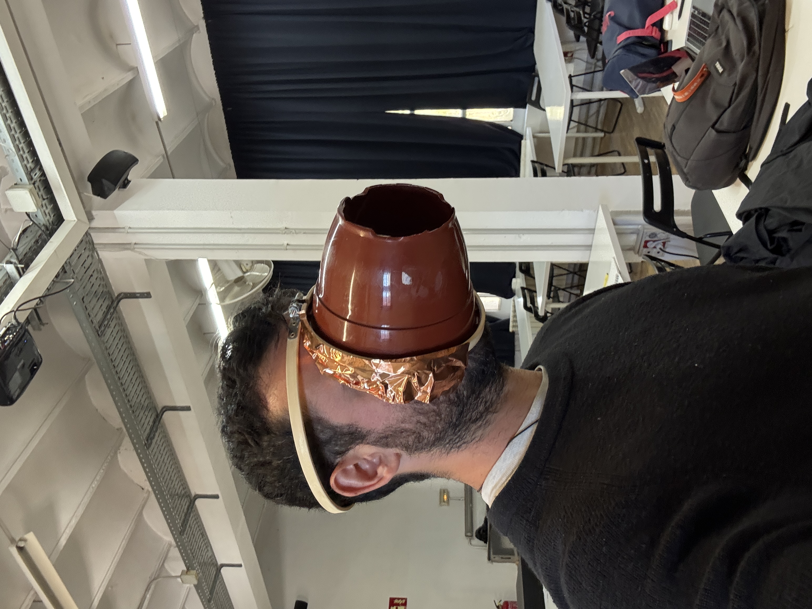
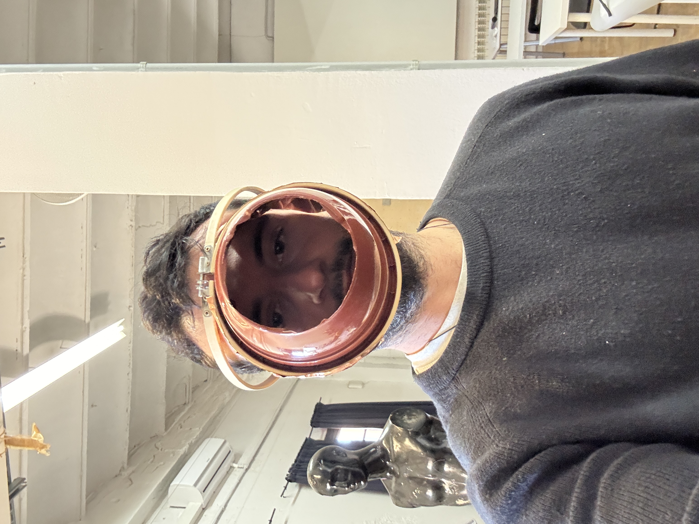
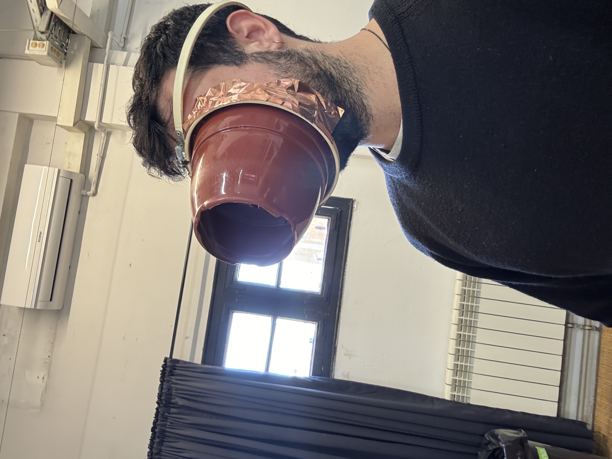
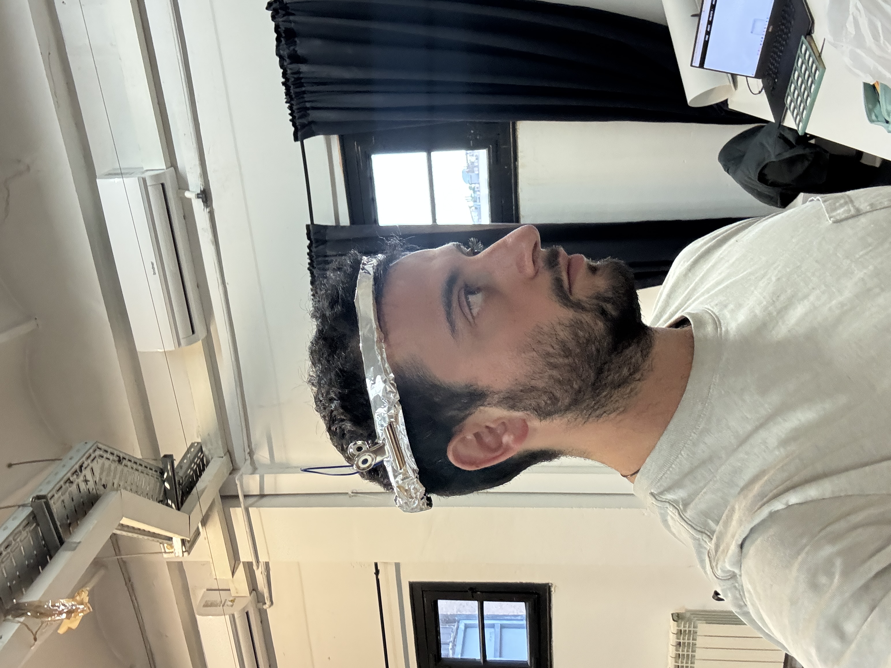
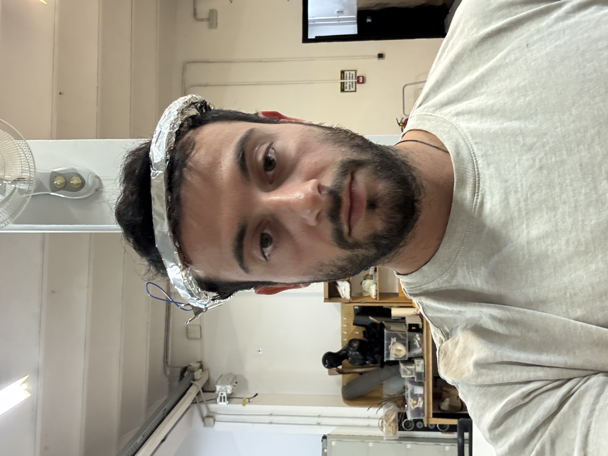
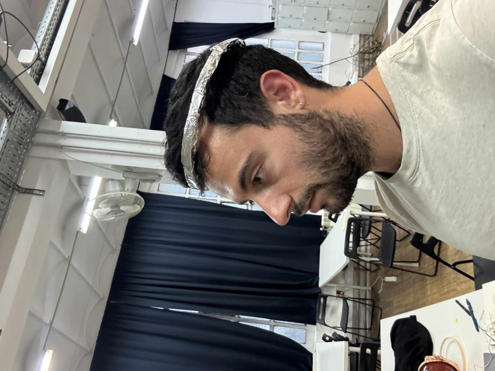
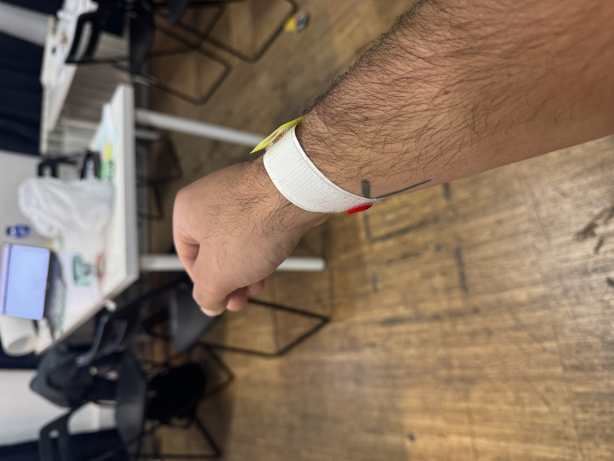
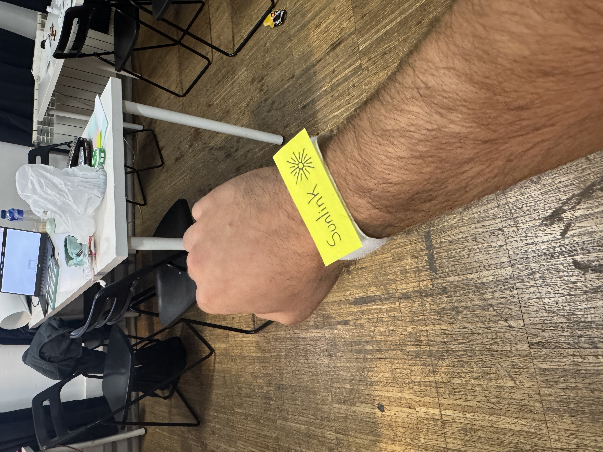
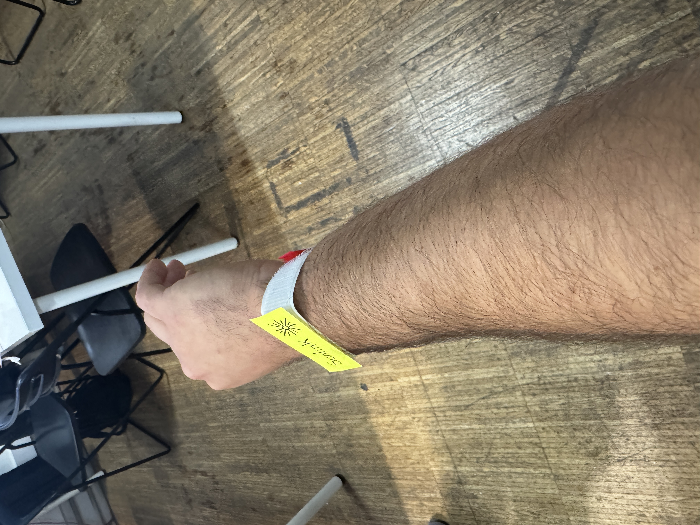

# Living With Your Own Ideas - October 28

## Prototypes to "become the best version of yourself"

**Tunnel Vision Prosthesis**

Tunnel Vision is a head-mounted facial extension that narrows my visual field to help me focus and signals to others that I'm in a state of intentional attention and shouldn't be talked to.

<iframe width="560" height="315" src="https://www.youtube.com/embed/HdJuSs-dL7U" title="YouTube video player" frameborder="0" allow="accelerometer; autoplay; clipboard-write; encrypted-media; gyroscope; picture-in-picture; web-share" allowfullscreen></iframe>

<iframe width="560" height="315" src="https://www.youtube.com/embed/r3Z4H72lIJo" title="YouTube video player" frameborder="0" allow="accelerometer; autoplay; clipboard-write; encrypted-media; gyroscope; picture-in-picture; web-share" allowfullscreen></iframe>

**Navigation Band Prosthesis**

The Navigation Band is a vibrating headband that points toward my destination, turning navigation into an embodied sense so I can move through the world without looking at my phone.

<iframe width="560" height="315" src="https://www.youtube.com/embed/wwhrVuCyCjk" title="YouTube video player" frameborder="0" allow="accelerometer; autoplay; clipboard-write; encrypted-media; gyroscope; picture-in-picture; web-share" allowfullscreen></iframe>

**Solarlink Prosthesis**

Solarlink is an exo-organ wristband that connects to an outdoor light sensor and wakes me through gentle vibration when the sun reaches a chosen brightness, reconnecting my circadian rhythm to the sun's cycles.

## Next Steps

I really want to make a working prototype of the Navigation Band prosthesis. I think it would be really helpful when biking, and also could be really fun to pair with the Derives I'm prototyping for Embodied Criticism acts/prototypes. It could be a good way to help me embody wandering.
