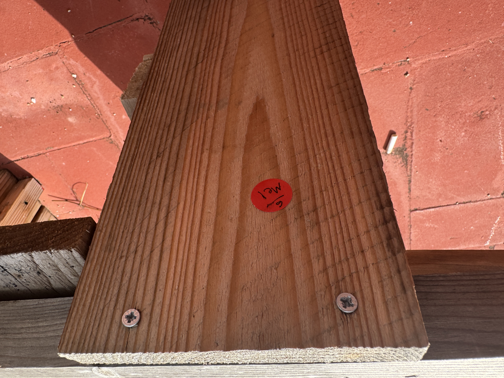

# Living With Your Own Ideas - October 30

## Prototypes to "judge and be judged"

**As a Subject**

The prosthesis I chose was a reel of red stickers. I wanted to be seen as meticulous documentarian. For every person or object I interacted with, I left a red sticker nearby with a one to three word note on it. The idea was to spend half the time keeping records, and then spend the second half trying to retrace my steps.

Pretty soon into the exercise I realized that my detective either was amazing at their job, or had lost me, so I started putting up stickers with directions and notes of where I was going so they could follow me and hopefully catch up.

I ended up at Cap Problema and got a sandwich to go. On the way back I tried to retrace my steps by finding all the stickers I had left. It was a fascinating experience. I had just written them, but I was having trouble finding them all and remembering their order. I even passed by things that looked like my red stickers, but turned out to be paint, or other stickers unrelated to me.

This exercise made me realize how hard it is to retrace our own memory. So much gets lost when we don't document, but clearly not everything is worth documenting. I spoke yesterday in class about how what we present to others is only a fraction of ourselves and we can never fully be seen by others. This made me realize that we might never be able to be fully seen by ourselves either. 

**As a Detective**

I did a pretty bad job being a sly detective. My subject (Heba) figured out pretty quickly that I was following her. 

Her prosthesis of choice was a role of blue tape. At first glance it didn't give me much to work with in terms of judging her, so I decided to pay attention to her behavior.

I think that the tape was purely aesthetic. She never used it once to tape anything. Instead, it was a symbol of how she wanted to be observed: as someone who sticks with things and brings others close to her.

First she talked about wanting to bring lunch to class, so she ended up cooking for 3 hours the night before, even though it would have been easier to just buy lunch. Sounds like something someone who sticks with things would do.

Then she talked about the struggles she was having with her website, and how despite them all she was determined to get it up and running. 

Then I watched how she engaged others who walked by us. Every time someone entered into our bubble she welcomingly brought them into our space and engaged them. Not in an attempt to force them to stay by us, but as a radiating energy that unconsciously encouraged them to stay close.

Also, for the entire observational period, I realized that I was always within a few feet of her. Some other detectives' strategies were to follow at a distance. The second Heba put on the roll of tape I walked up to her and was stuck for the whole session. Even after the exercise was over I ended up moving from my previous seat to sit next to her for the rest of the day.

