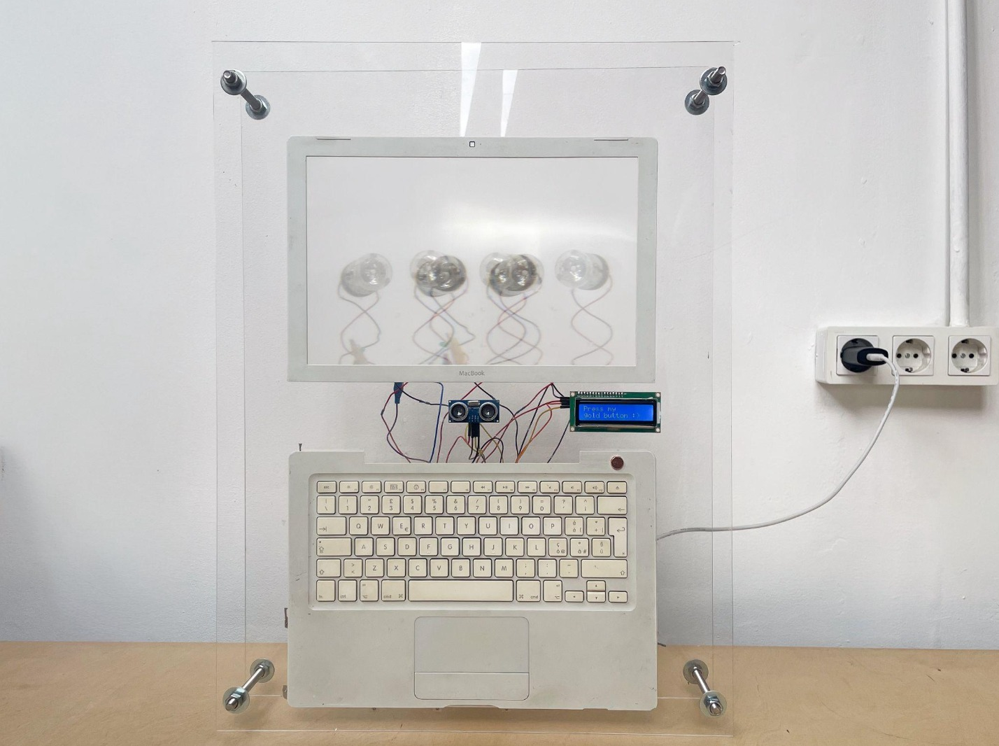
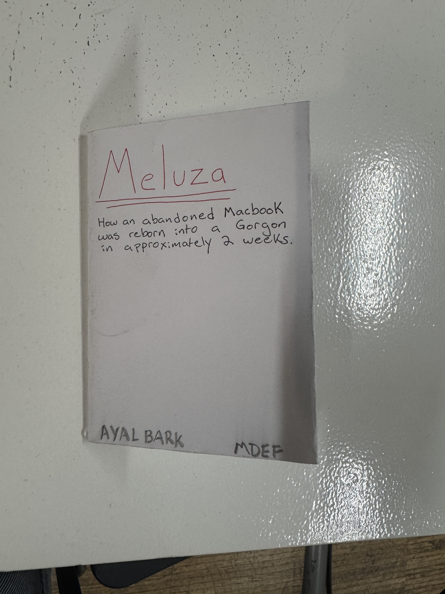
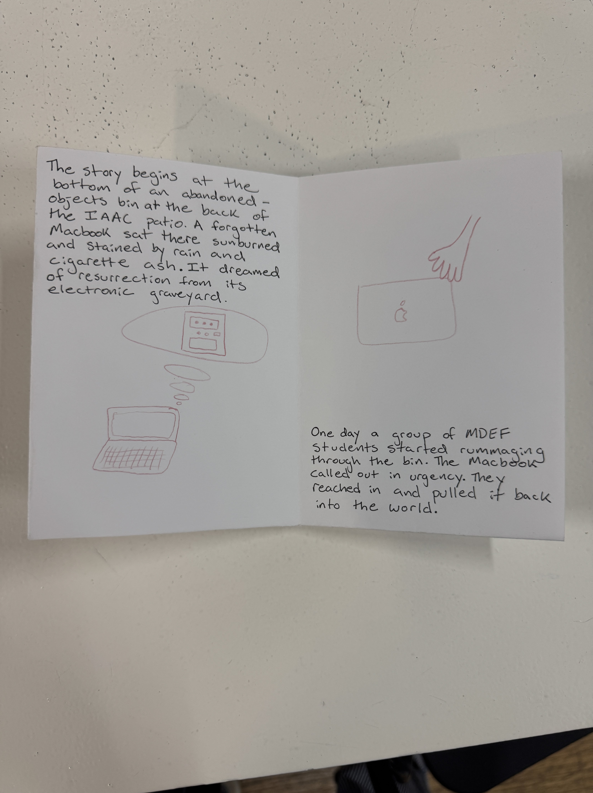
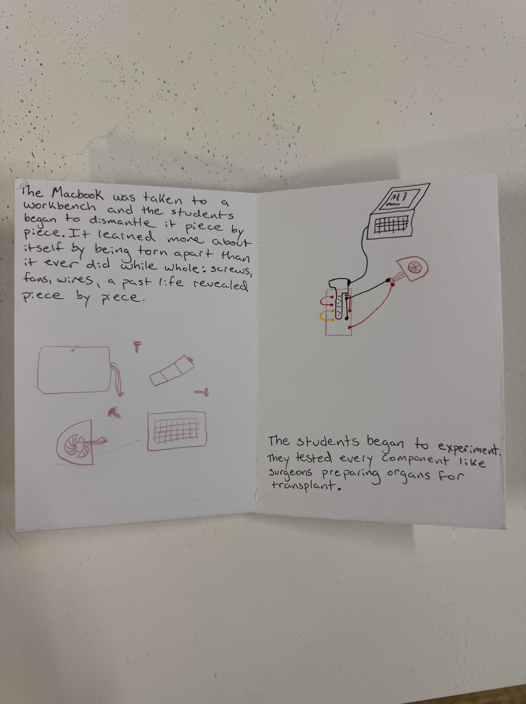
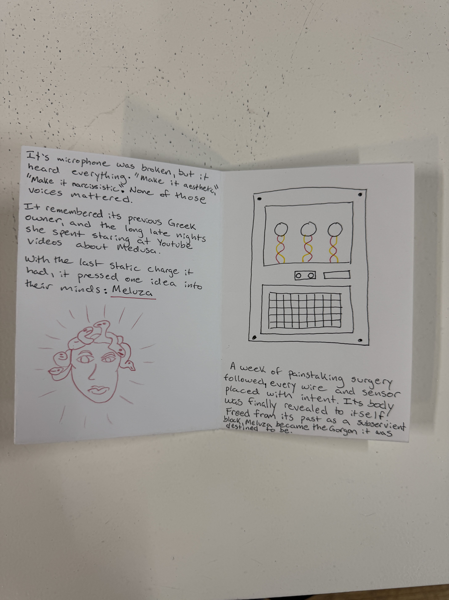
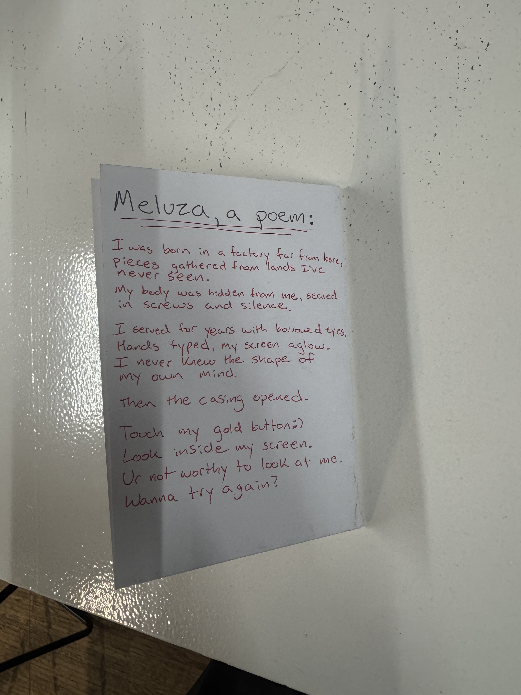

# Unpacking Intelligent Machines

## Overview  

**Meluza**

The name Meluza is a play on words of the Spanish "Medusa" which refers to both the mythical character and jellyfish, and "luz" which means light. 

Meluza lures you in to look at her (like the mythical Medusa), but instead of turning you to stone, she blinds you with her brilliant light. Her internal/external wiring resembles both a jellyfish, and the many serpents in Medusa's hair.

**Youtube Video**
<iframe width="560" height="315" src="https://www.youtube.com/embed/KEEMSzthFg0" title="YouTube video player" frameborder="0" allow="accelerometer; autoplay; clipboard-write; encrypted-media; gyroscope; picture-in-picture; web-share" allowfullscreen></iframe>  

*if embedded video doesn't work, please [click here](https://www.youtube.com/embed/KEEMSzthFg0)*

**Presentation**
<iframe src="https://docs.google.com/presentation/d/15L3aPrOG1Eg2wkkGKGjhqTKlLL-P-4r6/preview" width="960" height="569" frameborder="0" allowfullscreen="true" mozallowfullscreen="true" webkitallowfullscreen="true"></iframe>  

*if embedded presentation doesn't work, please [click here](https://docs.google.com/presentation/d/15L3aPrOG1Eg2wkkGKGjhqTKlLL-P-4r6/preview)*

## Reflection  
This week was one of my favorite weeks in the program so far. I loved the hands on experience of building something. Most of the creating so far has felt pretty surface level, and I appreciated the opportunity to go in depth over the course of the week.  

This week spoke truth to the phrase "if you want to go fast, go alone, if you want to go far, go in a group." It took a bit of negotiation and friction to come up with a concept that we all agreed on as a group, but once it was decided we were able to take it to a level of completion that I would never have been able to do on my own. It was also really cool to see how each person brought their own strengths and skills to the table, and how comfortable we were relying on each other. 

I spent a lot of time on the electronics and inputs/outputs side of the project with Erandi and Ivan. It was great to work closely with them because they both already had some fundamental knowledge of these things and were able to teach me the ropes. From there, it was cool to come up with a joint methodology of using AI (ChatGPT) to help us with the Arduino code. Instead of asking it to write the whole thing for us, we would prompt it in what I'm calling MVCs (minimal viable changes). Each MVC would be just enough to change one little variable, and then by seeing if it changed the behavior of the circuit/components, I could see HOW the code worked. By the end I was able to look at the entire code and understand what each line did. I don't think I could write it from scratch, but when we wanted to make little changed (for example to the time a message was shown) I was able to go in and do that manually without any reliance on AI. I would like to try to define and give some structure to this methodology and then refine it by working on some other projects.

## Zine

  
  
  
  
  

