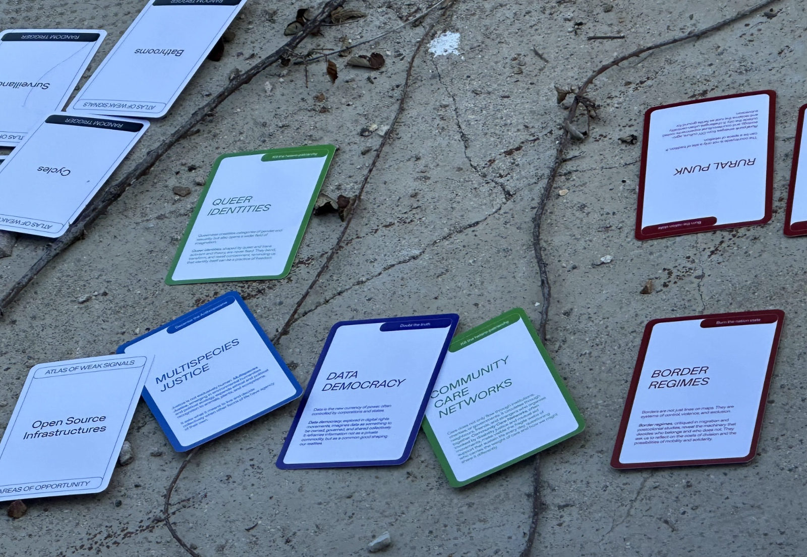
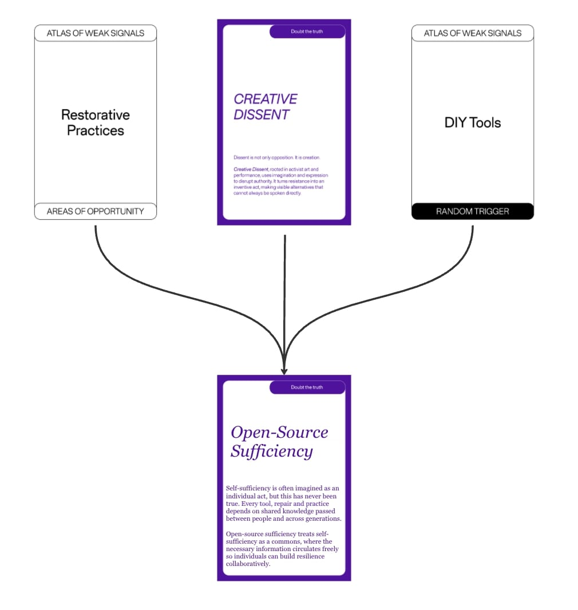
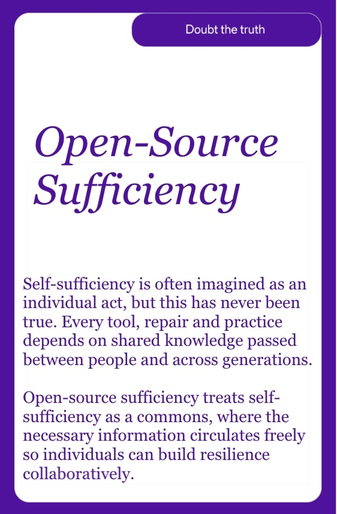

---
hide:
    - toc
---

# Atlas of Weak Signals

The Atlas of Weak Signals is a deck of cards to detect trends before they become trends. It is an ongoing project by Fablab Barcelona and the Masters for Design in Emergent Futures

The Weak Signals map early patterns of change that quietly shape emerging futures. Weak signals are subtle shifts in areas like culture, technology, and ecology that reveal new possibilities long before they become mainstream. By naming and exploring them, we learn to sense where the world is moving and how design might intervene with intention. 

My group's addition to the Atlas of Weak Signals ecosystem is **Poison Pilling**  

# Poison Pilling (October 5, 2025)

Description: Poison pilling (or data poisoning) is the deliberate insertion of malicious, misleading, or corrupted data into datasets used to train machine learning or AI models. The goal is to “poison” the model’s learning process so it behaves incorrectly, produces biased or nonsensical outputs, or even leaks sensitive data.  

*the definition was copied from ChatGPT when asked: “Do you know what poison pilling is as it relates to putting in data that messed up ai data training?”  

We then asked ChatGPT how it felt about this practice. [Here is the link to its response](https://chatgpt.com/share/6937e4f3-3b4c-8009-a287-3997a9f7259c). 

Group Members:
Beste, Ayal, Agnese, Max, Heba, Aiman

# Open-Source Sufficiency (Dec 9, 2025)  

On Tuesday, December 9th, 2025 we revisited the Atlas of Weak Signals. My group sat together and grabbed the deck of cards. We played a few practice rounds to refresh our memory of how the cards worked, and then were ready to play.  

Our *Random Trigger* card was "DIY Tools", and our *Area of Opportunity* card was "Restorative Practices".  

We all had a lot to share, but we kept on circling around self-sufficiency techniques. This led us to coin a new Weak Signal: *Open-Source Sufficiency*  

We generated an image of Open-Source Sufficiency using ChatGPT, and were happy with the image of the woman repairing what looks like an engine using a wrench and a schematics.

We spent a while talking about what types of artifacts/services would live inside this emergent future. The list was a sort of venn diagram consisting of maker spaces, workshops, solarpunk things, and eco-villages.
- Fablabs
- Maker Movement
- Right to Repair
- Workshops at Squats
- Solarpunk communities
- Solarpunk cities
- Solarpunk eco-village

I think the "ultimate" artifact in this scenario would be a sort of fablab spin off that is completely centered on self-sufficiency. It would take the form of a rural  homestead, or urban cooperative squat, where people live as off-grid as possible while teaching others how to do so themselves.

# Reflection (Dec 10, 2025)  
I'm starting to see the utility of the Atlas of Weak Signals as a tool to add to my design practice. I like that it gives clear constraints, while leaving enough room to let new ideas breathe. 

So far we have only used it to speculate. And while I feel like it is a useful tool to speculate on emerging trends, I think that what has been missing so far is the follow up on how to bridge that into our design practices. Instead of coming up with examples of artifacts/services that live inside these weak signals, I would like to try prototyping them next. 
