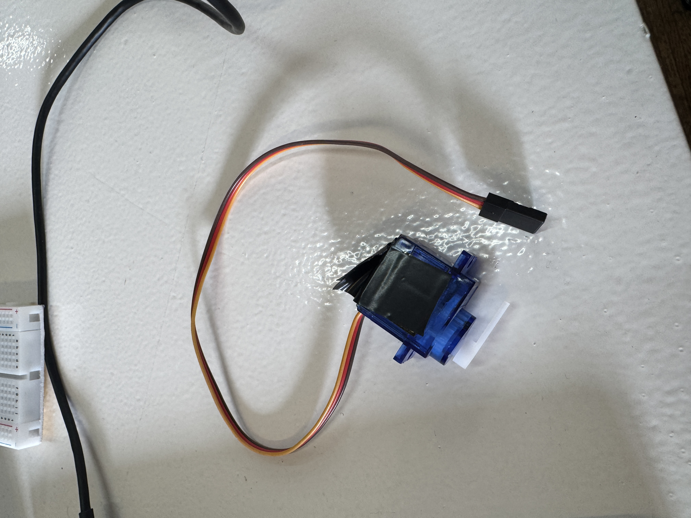
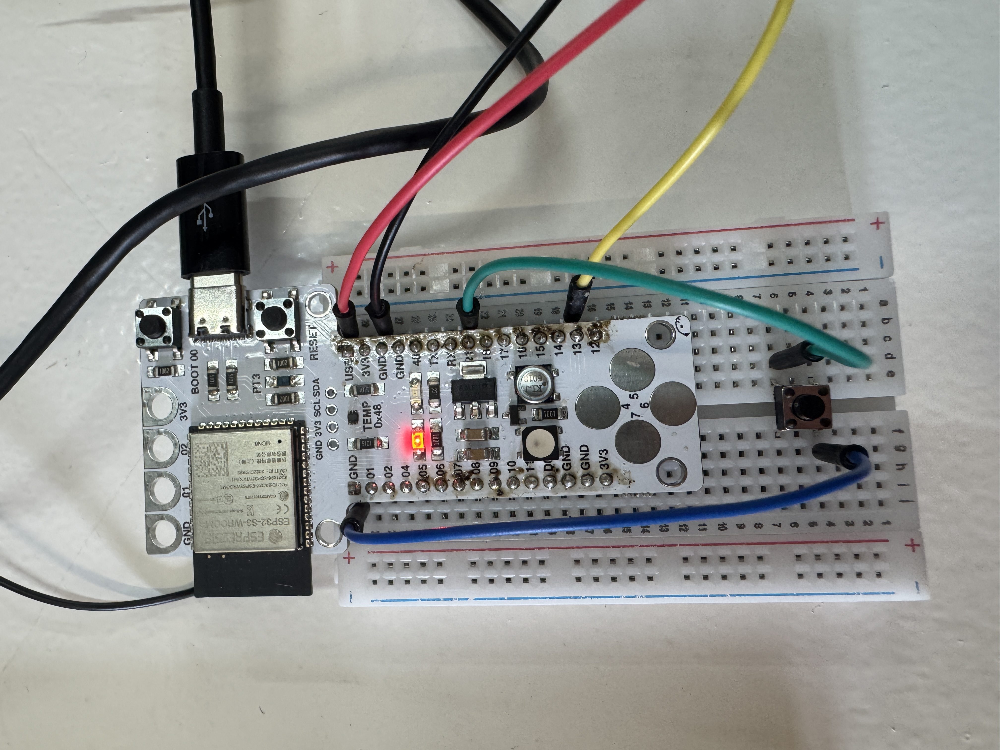
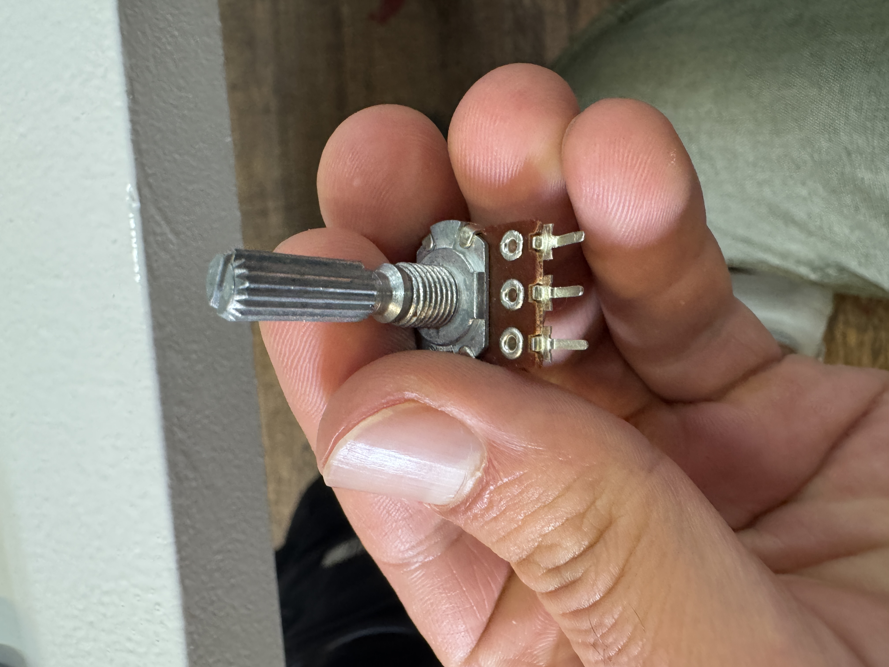
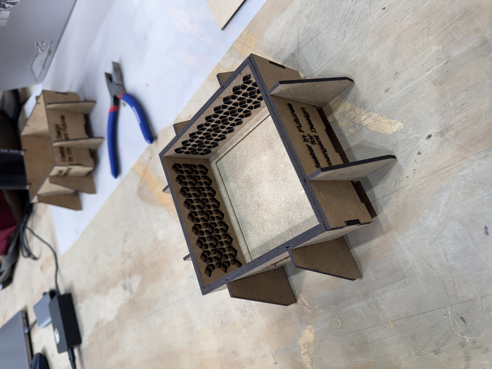
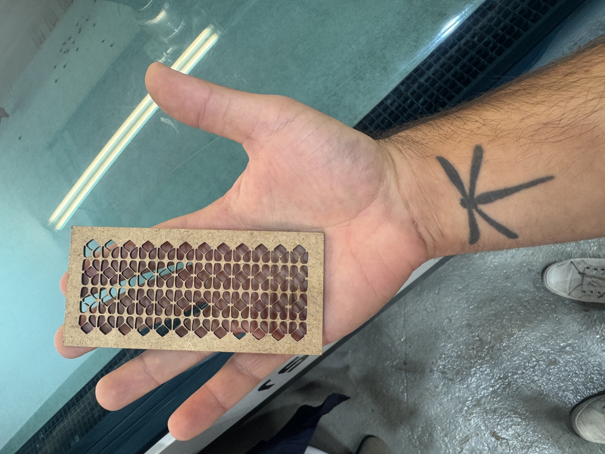

# Fundamentals for Future Makers

## Overview  

Before arriving at IAAC for the MDEF program I was asked the same question over and over: "What are you going to be studying?".   

"Design of Emergent Futures" leads to even more questions, so I ended up answering with something along the lines of *"I'm going to study design, but how to actually build the things I design."*   

My main reasons for signing up for MDEF was to bridge the gap I had between ideation and execution. It's easy to come up with an idea, it's a lot harder to bring it to life.  

Through a series of weekly workshops, The Fundamentals for Future Makers course attempted to provide some baseline knowledge for this. Below are the workshops organized in chronological order, along with some of my reflections on them.

## Inputs & Outputs

This class had a lot of overlap with the pre-course material. It was a nice refresher to remember how the Arduino IDE works, and how to use the example code templates included in the software as starting points when feeling lost.

I spent some time playing with a servo motor. I was able to make it rotate when I touched a capacitive sensor. Then I made it rotate when I touched a button. Then I attached a rotary encoder to try to make micro adjustments in the servo. It ended up being way more finnicky than I expected it. 

I gained a huge respect for people who write code for moving parts. I can't imagine how complex all that stuff gets. I got to play around more with this during Unpacking Tech Systems when programming the circuitry for Meluza. I found the familiarity I had built from this workshop and the precouse super helpful. 

## 2D Fabrication (Laser Cutting and Vinyl Cutter)

As much as I loathe Rhino, I felt pretty comfortable with the laser cutter and vinyl cutter. I think the fact that the files are 2D makes it much more approachable for me. The second things become 3D it gets harder for me to wrap my head around all of the moving pieces in Rhino.

I teamed up with Heba for this workshop (and the remaining ones). It was great to work with her because she is much more proficient in Rhino than me, and was happy to help me when I got stuck.

I'd like to revisit these 2D fabrication techniques to try out using laser cutting for textiles. I want to ask Ivan to show me how to use the sowing machine, and see if we could laser cut some denim or another material and make some simple clothing items. 

## 3D Printing

As I wrote previously, 3D modeling with Rhino is not my forte. That said, I was glad for the challenge, and Heba and I made a cool flower inspired tile. I really liked using the Bambu Labs software. It's quite intuitive, at least more so than the printing software for the laser cutter, and the software for the CNC. 

I like that there isn't as big of a margin of error in 3D printing as there is in laser cutting (fires and toxic exhaust) or CNC milling (breaking bits, serious injury). I have a lot of room for improvement in this modality, and a lot of oppportunity to practice since we have a 3D printer in our classroom.

## CNC Milling

I felt the least comfortable with CNC milling. It feels like the modality with the largest room for error. Not only in the potential to mess up the machine, but also in the complexity of the files and organization required to get a final product that matches what you set out to make.   

That said, I feel called to it for some future projects. Especially modular furniture. Not that that is part of my current design bet, but I would like to get more experience with the CNC machine while it's so easily accessible. 

## Casting and Molding

This workshop was a nice way to bring all the previous ones together and put the things we made to use. I wish we would have been warned about designing small holes on the insides of the box we laser cut. They became the outsides of the mold, and silicon got inbetween the two layers of walls in such a way that it was it was impossible to remove the mold without breaking the box. In the process we the silicone also ripped, and we  broke the walls of the mold making it not suitable for casting. On second thought I am kind of glad we were able to make this mistake because I'm sure we will never repeat that error again.

## Biomaterials
This workshop felt like kindergarten in the best way possible. It was super fun to get our hands dirty and experiment with the biomaterials. It felt extremeley low stakes with a low barrier to entry. All we needed was some materials and burners. Nothing too risky. 

I would love to continue experimenting with biomaterials. I want to make a set of coasters. The ones we made were too brittle, but I wonder if we could make another resin based thing that is more sturdy. I'd also like to make some thin fabric that we can laser cut on, or maybe even run through a printer. 

## Touch Designer
This workshop was cool. Kind of random, but cool. It felt a lot different than the other workshops because it was entirely digital. Nothing existed the digital realm and became tactile. That said, I liked that we got to put the modality into practice at the same time as we learned. That was a much more approachable learning method than the previous workshops. 

## Final Reflections

All in all I would have loved to go deeper with these workshops. I felt like I only got to scratch the surface with these, which is understandable since we had such little time with each. 

At the very least, I walked away with a familiarity with the machines. I feel comfortable using them without hurting myself, anyone else, or the machines. But, I don't feel like there was enough time to do much more than familiarize myself. 

I'm left feeling drawn towards some modalities (Inputs/Outpus, 3D printing, biomaterials) more than others. I'm unsure if I should follow that pull, or if I should actively try to counteract it so that I am more well-rounded. 

